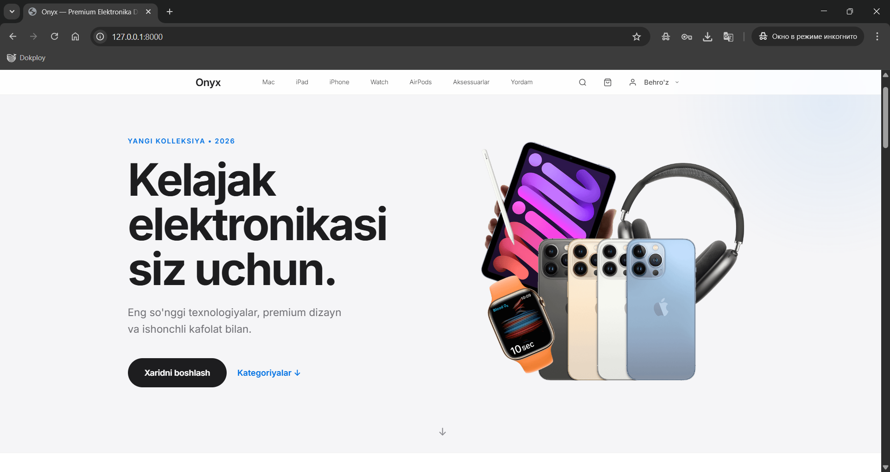

# ⚡ NEXUS — Premium Elektronika Do'koni

<p align="center">
  
</p>

<p align="center">
  <b>O'zbekiston bozori uchun qurilgan zamonaviy e-commerce platforma</b><br/>
  ASUS/ROG uslubidagi glassmorphism dizayn · AJAX real-time interfeys · Docker tayyor
</p>

<p align="center">
  
  
  
  
  
</p>

---

## ✨ Imkoniyatlar

| # | Imkoniyat | Tavsif |
|---|---|---|
| 🛍 | **Premium Storefront** | ASUS/ROG glassmorphism dizayn, micro-animatsiyalar, mega-menu |
| 🔍 | **Real-time Qidiruv** | AJAX asosida — sahifa yangilanmasdan ishlaydi |
| 🗂 | **Kategoriya Filtri** | Noutbuklar, Monitorlar, Aksessuarlar, Gaming bo'limlari |
| 🛒 | **AJAX Savat** | Savatga qo'shish, miqdor o'zgartirish — real-time badge |
| 📦 | **Buyurtma Tizimi** | Checkout, holat kuzatuvi, chek chiqarish |
| 🖥 | **Manager Panel** | Glassmorphism admin — mahsulot, ombor, buyurtma, foydalanuvchilar |
| 🖼 | **Image Cropper** | Drag & Drop rasm + Cropper.js bilan standart formatga solish |
| 🐳 | **Docker** | PostgreSQL + Gunicorn + WhiteNoise — bitta buyruq bilan ishga tushadi |
| 📊 | **Dashboard Analytics** | Daromad, foyda, xarajat va sotuvlar statistikasi |

---

## 🛠 Texnologiyalar

### Backend
- **Python 3.12** · **Django 6.0** · **Django REST Framework 3.17**
- **PostgreSQL 16** (production) · SQLite (development)
- **Gunicorn** — production WSGI server
- **WhiteNoise** — statik fayllar

### Frontend
- **Django Templates** · **Vanilla CSS** · **Vanilla JavaScript**
- **Glassmorphism** dizayn (`backdrop-filter: blur`)
- **Google Fonts** — Inter + Outfit
- **AJAX (Fetch API)** — partial template pattern

### DevOps
- **Docker** + **Docker Compose**
- **django-unfold** — zamonaviy admin UI
- **Pillow** — rasm qayta ishlash
- **Cropper.js** — frontend rasm qirqish

---

## 🚀 Ishga Tushirish

### 🐳 Docker bilan (tavsiya etiladi)

```bash
git clone https://github.com/Shakh07/Marketplace.git
cd Marketplace
docker-compose up -d --build
```

Dastur avtomatik ravishda `http://localhost:8000` da ishga tushadi.

### 💻 Lokal (development)

```bash
python -m venv venv
venv\Scripts\activate          # Windows
pip install -r requirements.txt
python manage.py migrate
python manage.py runserver
```

### 🗄 Test ma'lumotlarini yuklash

```bash
python manage.py seed_data
```

---

## 🌐 Asosiy Sahifalar

| URL | Tavsif |
|---|---|
| `/` | Bosh sahifa (hero banner, kategoriyalar, featured mahsulotlar) |
| `/products/` | Mahsulotlar katalogi |
| `/products/?category=laptops` | Kategoriya bo'yicha filtrlash |
| `/cart/` | Xarid savati |
| `/checkout/` | Buyurtma rasmiylashtirish |
| `/orders/` | Buyurtmalar tarixi |
| `/manager/` | Manager boshqaruv paneli |
| `/admin/` | Django Unfold admin |

---

## 📁 Tuzilishi

```
Marketplace/
├── apps/
│   ├── accounts/      # Foydalanuvchilar va autentifikatsiya
│   ├── catalog/       # Mahsulotlar, kategoriyalar, brendlar
│   ├── orders/        # Savat, checkout, buyurtmalar
│   ├── manager/       # Admin boshqaruv paneli
│   ├── warehouse/     # Ombor va zaxira
│   ├── reviews/       # Sharhlar tizimi
│   ├── returns/       # Qaytarishlar
│   └── suppliers/     # Yetkazib beruvchilar
├── templates/         # HTML shablonlar
├── static/            # CSS, JS, ikonkalar
├── ecommerce/         # Django loyiha sozlamalari
├── Dockerfile
├── docker-compose.yml
├── entrypoint.sh
└── requirements.txt
```

---

## 👨‍💻 Muallif

**Shohruh** — Loyihani ishlab chiquvchi  
🔗 GitHub: [@Shakh07](https://github.com/Shakh07)

---

<p align="center"><i>NEXUS — kelajak bu yerda.</i></p>
