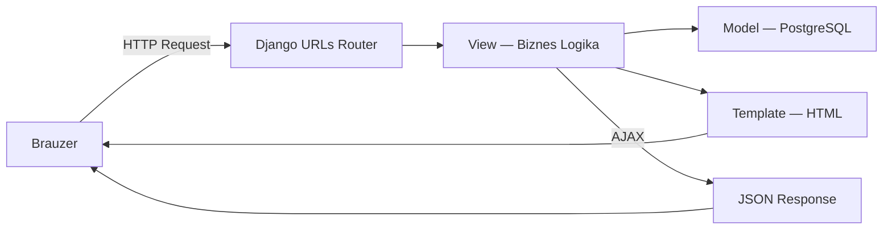
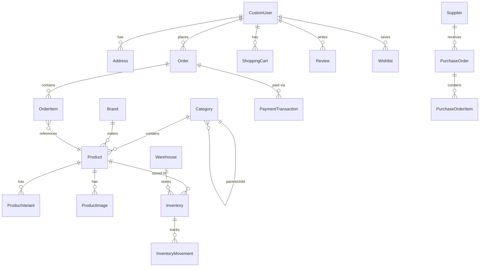

# ⚡ NEXUS — E-Commerce Platformasi: To'liq Texnik Hujjat

> **Muallif:** Shohruh  
> **GitHub:** [github.com/Shakh07/Marketplace](https://github.com/Shakh07/Marketplace)  
> **Sana:** 2026-yil, May

---

## 1. Loyiha Nima?

**NEXUS** — O'zbekiston bozori uchun mo'ljallangan to'liq funksional **premium elektronika do'koni platformasi**. U ikki asosiy qismdan iborat:

1. **Storefront (Xaridorlar tomoni)** — mahsulotlarni ko'rish, kategoriya bo'yicha filtrlash, savatga qo'shish, buyurtma berish va profil boshqarish.
2. **Manager Panel (Admin tomoni)** — buyurtmalar, mahsulotlar, ombor zaxirasi, foydalanuvchilar va bosh sahifa kontentini boshqarish.

Dizayn **ASUS / ROG** uslubida qurilgan — glassmorphism, premium tipografiya, neon aksentlar va silliq micro-animatsiyalar.

---

## 2. Texnologiyalar

### 2.1 Dasturlash Tillari

| Til | Ishlatilgan joy | Maqsad |
|---|---|---|
| **Python 3.12** | Backend | Django bilan asosiy server logikasi |
| **HTML5** | Templates | Sahifa strukturasi |
| **CSS3** | Dizayn | Glassmorphism, animatsiyalar, ranglar |
| **JavaScript ES6+** | Frontend | AJAX, real-time UI, savat, mega-menu |
| **SQL** | Ma'lumotlar bazasi | Django ORM orqali PostgreSQL |
| **Bash** | DevOps | `entrypoint.sh` — Docker ishga tushganda migrate + server |

### 2.2 Framework va Kutubxonalar

| Kutubxona | Versiya | Maqsad |
|---|---|---|
| **Django** | 6.0.3 | Backend framework: URL routing, ORM, templates, auth |
| **Django REST Framework** | 3.17.1 | REST API — JSON endpointlar |
| **django-cors-headers** | 4.9.0 | Cross-origin so'rovlarga ruxsat |
| **django-unfold** | 0.87.0 | Django admin panelini zamonaviy UI bilan almashtirish |
| **Pillow** | 12.2.0 | Rasm yuklash va qayta ishlash |
| **Faker** | 40.12.0 | Test ma'lumotlari generatsiyasi |
| **Gunicorn** | ≥21.2.0 | Production WSGI serveri |
| **psycopg2-binary** | ≥2.9.9 | PostgreSQL ulanish drayveri |
| **dj-database-url** | ≥2.1.0 | `DATABASE_URL` dan baza sozlamalarini o'qish |
| **WhiteNoise** | ≥6.7.0 | Statik fayllarni production da xizmat ko'rsatish |
| **pandas / numpy** | 3.0.2 / 2.4.4 | Dashboard statistika va hisobotlar |

### 2.3 Infratuzilma

| Texnologiya | Maqsad |
|---|---|
| **Docker** | Loyihani izolyatsiyalangan muhitda ishlatish |
| **Docker Compose** | `web` + `db` konteynerlarini birgalikda boshqarish |
| **PostgreSQL 16** | Production ma'lumotlar bazasi |
| **Git** | Versiya nazorati |

---

## 3. Arxitektura

Loyiha **Django MTV (Model-Template-View)** arxitekturasiga asoslangan:



### AJAX Pattern (Real-time yangilanish)

```
Foydalanuvchi yozadi
  → 400ms debounce
  → fetch(url, { headers: { 'X-Requested-With': 'XMLHttpRequest' } })
  → Django: AJAX? → faqat <tbody> HTML qaytaradi
  → JavaScript: element.innerHTML = data.html
  → URL: history.pushState() — sahifa YANGILANMAYDI
```

---

## 4. Django Ilovalar (Apps)

Loyiha **8 ta Django app** dan tashkil topgan:

### 4.1 `apps/accounts` — Foydalanuvchilar

| Model | Tavsif |
|---|---|
| `CustomUser` | `AbstractUser` kengaytmasi. `user_type`, `account_status`, `loyalty_points` |
| `Address` | Yetkazish manzillari (shahar, ko'cha, pochta indeksi) |
| `SiteSettings` | Singleton — sayt nomi, kontakt, ijtimoiy tarmoqlar |
| `PasswordResetToken` | Parol tiklash tokeni |
| `UserSession` | Sessiyalarni kuzatish (IP, qurilma, vaqt) |

### 4.2 `apps/catalog` — Mahsulotlar Katalogi

| Model | Tavsif |
|---|---|
| `HeroSection` | Singleton — bosh sahifa hero banneri (admin boshqaradi) |
| `Category` | Ierarxik kategoriyalar (parent/child). Slug bo'yicha filtrlanadi |
| `Brand` | Brendlar (ASUS, ROG, va boshqalar) |
| `Product` | Asosiy mahsulot: nom, narx, SKU, status, reyting |
| `ProductVariant` | Variantlar (rang, hajm) — har birida alohida narx |
| `ProductImage` | Mahsulot rasmlari (asosiy + qo'shimcha) |
| `ProductAttribute` | Kategoriyaga xos atributlar (masalan: Ekran o'lchami) |
| `Tag` / `ProductTag` | Teglar (#yangi, #aksiya) |
| `Wishlist` | Sevimli mahsulotlar |

### 4.3 `apps/orders` — Buyurtmalar

| Model | Tavsif |
|---|---|
| `Order` | Buyurtma: raqam, status, to'lov holati |
| `OrderItem` | Buyurtmadagi har bir mahsulot |
| `ShoppingCart` | Vaqtinchalik savat |
| `PaymentTransaction` | To'lov tranzaksiyalari |

### 4.4 `apps/warehouse` — Ombor

| Model | Tavsif |
|---|---|
| `Warehouse` | Fizik omborlar |
| `Inventory` | Mahsulot zaxirasi (ombor bo'yicha) |
| `InventoryMovement` | Kirim/chiqim tarixi |

### 4.5 `apps/reviews` — Sharhlar

| Model | Tavsif |
|---|---|
| `Review` | 1–5 yulduz baho + matn sharh |
| `ReviewImage` | Sharhga biriktilgan rasmlar |

### 4.6 `apps/returns` — Qaytarishlar
`Return`, `ReturnItem` — qaytarish so'rovlari va holati.

### 4.7 `apps/suppliers` — Yetkazib Beruvchilar
`Supplier`, `PurchaseOrder`, `PurchaseOrderItem`.

### 4.8 `apps/manager` — Admin Panel
O'zining modeli yo'q — boshqa app'lar modellaridan foydalanadi. `views.py` loyihadagi eng katta fayl.

---

## 5. Sahifalar Ro'yxati

### 5.1 Storefront (Xaridorlar)

| # | Sahifa | URL | Template |
|---|---|---|---|
| 1 | Bosh sahifa | `/` | `home.html` |
| 2 | Mahsulotlar katalogi | `/products/` | `catalog/product_list.html` |
| 3 | Kategoriya filtri | `/products/?category=laptops` | `catalog/product_list.html` |
| 4 | Mahsulot tafsiloti | `/products/<slug>/` | `catalog/product_detail.html` |
| 5 | Savat | `/cart/` | `orders/cart.html` |
| 6 | Checkout | `/checkout/` | `orders/checkout.html` |
| 7 | Buyurtmalar tarixi | `/orders/` | `orders/order_list.html` |
| 8 | Buyurtma tafsiloti | `/orders/<id>/` | `orders/order_detail.html` |
| 9 | Chek chop etish | `/orders/<id>/receipt/` | `orders/receipt_print.html` |
| 10 | Ro'yxatdan o'tish | `/auth/register/` | `accounts/register.html` |
| 11 | Kirish | `/auth/login/` | `accounts/login.html` |
| 12 | Profil | `/profile/` | `accounts/profile.html` |
| 13 | Yordam markazi | `/help/` | `catalog/help_page.html` |

### 5.2 Manager Panel (Admin)

| # | Sahifa | URL |
|---|---|---|
| 14 | Dashboard | `/manager/` |
| 15 | Buyurtmalar | `/manager/orders/` |
| 16 | Buyurtma tafsiloti | `/manager/orders/<id>/` |
| 17 | Mahsulotlar | `/manager/products/` |
| 18 | Mahsulot qo'shish | `/manager/products/add/` |
| 19 | Mahsulot tahrirlash | `/manager/products/<id>/edit/` |
| 20 | Ombor (Zaxira) | `/manager/inventory/` |
| 21 | Foydalanuvchilar | `/manager/users/` |
| 22 | Foydalanuvchi tafsiloti | `/manager/users/<id>/` |
| 23 | Storefront sozlamalari | `/manager/storefront/` |
| 24 | Kategoriyalar | `/manager/categories/` |
| 25 | Brendlar | `/manager/brands/` |

### 5.3 REST API Endpointlar

| Endpoint | Method | Tavsif |
|---|---|---|
| `/api/categories/` | GET | Kategoriyalar ro'yxati |
| `/api/brands/` | GET | Brendlar ro'yxati |
| `/api/products/` | GET | Mahsulotlar (`?category=`, `?brand=`, `?search=`) |
| `/api/products/<slug>/` | GET | Mahsulot tafsiloti |
| `/api/wishlist/` | GET/POST | Sevimlilar |
| `/api/auth/register/` | POST | Ro'yxatdan o'tish |
| `/api/users/me/` | GET/PUT | Profil |
| `/api/addresses/` | GET/POST | Manzillar |
| `/api/orders/` | GET | Buyurtmalar |
| `/api/cart/` | GET | Savat |

> **Jami:** 25 ta veb-sahifa + 10 ta API endpoint = **35 ta route**

---

## 6. Fayl Tuzilishi

```
Marketplace/
├── 📁 apps/
│   ├── accounts/          # Foydalanuvchilar, auth, profil, manzillar
│   ├── catalog/           # Mahsulotlar, kategoriyalar, brendlar, wishlist
│   ├── orders/            # Savat, checkout, buyurtmalar, to'lovlar
│   ├── manager/           # ⭐ Admin panel (views.py, forms.py, urls.py)
│   ├── warehouse/         # Ombor, zaxira, harakat tarixi
│   ├── reviews/           # Sharhlar, reaksiyalar
│   ├── returns/           # Qaytarishlar
│   └── suppliers/         # Yetkazib beruvchilar, xarid buyurtmalari
│
├── 📁 ecommerce/
│   ├── settings.py        # Asosiy Django sozlamalari
│   ├── urls.py            # Bosh URL router
│   └── wsgi.py            # Production entry point
│
├── 📁 templates/
│   ├── base.html          # Asosiy frontend shablon (navbar, footer, scripts)
│   ├── home.html          # Bosh sahifa
│   ├── accounts/          # Login, Register, Profile
│   ├── catalog/           # Product list, Product detail, Help
│   ├── orders/            # Cart, Checkout, Order list/detail, Receipt
│   └── manager/           # ⭐ Admin sahifalari
│       ├── base_manager.html      # Sidebar + topbar
│       ├── dashboard.html
│       ├── *_list.html            # Ro'yxat sahifalari
│       ├── *_partial.html         # AJAX uchun qisman templatelar
│       └── includes/image_cropper.html
│
├── 📁 static/
│   ├── css/style.css      # Global stillar (glassmorphism, ASUS theme)
│   └── js/                # JavaScript fayllar
│
├── 📁 media/
│   ├── products/          # Mahsulot rasmlari
│   ├── categories/        # Kategoriya rasmlari
│   ├── hero/              # Hero banner rasmi
│   └── brands/            # Brend logolari
│
├── Dockerfile
├── docker-compose.yml
├── entrypoint.sh          # migrate + collectstatic + gunicorn
├── requirements.txt
└── manage.py
```

---

## 7. Ma'lumotlar Bazasi Diagrammasi



**Jami:** 25+ ta jadval.

---

## 8. Dizayn Tizimi

### NEXUS / ASUS Uslubi

| Element | Qiymat |
|---|---|
| **Shriftlar** | `Outfit` (sarlavhalar) + `Inter` (matn) |
| **Asosiy fon** | `linear-gradient(135deg, #f5f7fa, #c3cfe2)` |
| **Glass panel** | `background: rgba(255,255,255,0.65)` + `backdrop-filter: blur(25px)` |
| **Aksent rang** | `#006ce1` (ASUS ko'k) |
| **Xavf rangi** | `#dc2626` (qizil) |
| **Muvaffaqiyat** | `#16a34a` (yashil) |
| **Burchaklar** | `16px – 28px` radius |
| **Soyalar** | `0 15px 35px rgba(0,0,0,0.05)` |

### Manager Panel (Floating Glass)

| Element | Qiymat |
|---|---|
| **Fon** | `#0a0e1a` (to'q ko'k-qora) |
| **Glass card** | `rgba(255,255,255,0.04)` + `blur(20px)` |
| **Aksent** | `#006ce1` |
| **Chegaralar** | `rgba(255,255,255,0.08)` |

---

## 9. Ishga Tushirish

### Docker bilan (production-style)
```bash
git clone https://github.com/Shakh07/Marketplace.git
cd Marketplace
docker-compose up --build -d
# → http://localhost:8000
```

### Lokal (development)
```bash
python -m venv venv
venv\Scripts\activate
pip install -r requirements.txt
python manage.py migrate
python manage.py runserver
```

### Muhim URL'lar
| URL | Tavsif |
|---|---|
| `http://localhost:8000/` | Bosh sahifa |
| `http://localhost:8000/manager/` | Admin panel |
| `http://localhost:8000/admin/` | Django Unfold admin |

---

## 10. Xulosa: Raqamlarda

| Ko'rsatkich | Qiymat |
|---|---|
| **Django app'lar** | 8 ta |
| **Database modellari** | 25+ ta |
| **Veb-sahifalar** | 25 ta |
| **REST API endpointlar** | 10 ta |
| **HTML template fayllari** | 30+ ta |
| **Partial (AJAX) templatelar** | 8 ta |
| **Python kutubxonalari** | 17 ta |
| **Dizayn uslubi** | ASUS/ROG Glassmorphism |
| **Ma'lumotlar bazasi** | PostgreSQL 16 |
| **Konteynerizatsiya** | Docker + Docker Compose |
| **Veb-server** | Gunicorn (production) |

---

## 👨‍💻 Muallif

**Shohruh** — Asosiy ishlab chiquvchi  
GitHub: [@Shakh07](https://github.com/Shakh07)

---

*NEXUS — kelajak bu yerda.*
